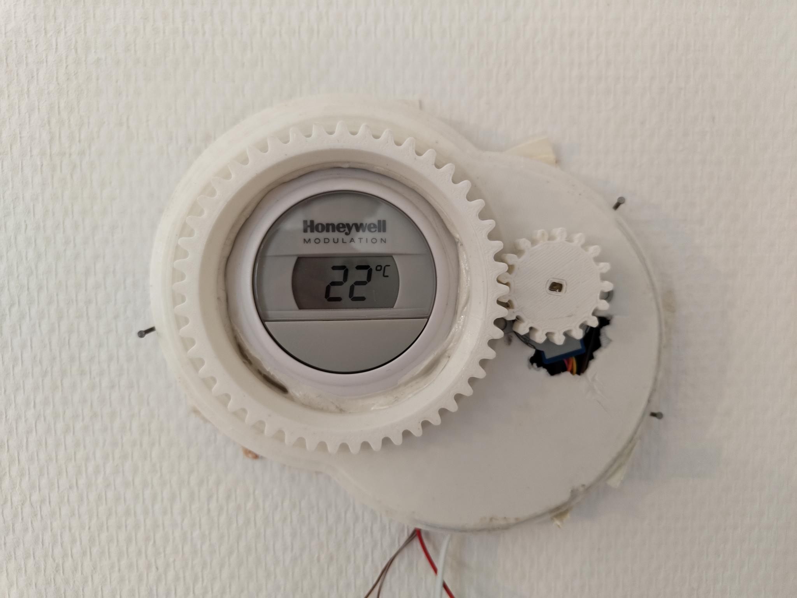
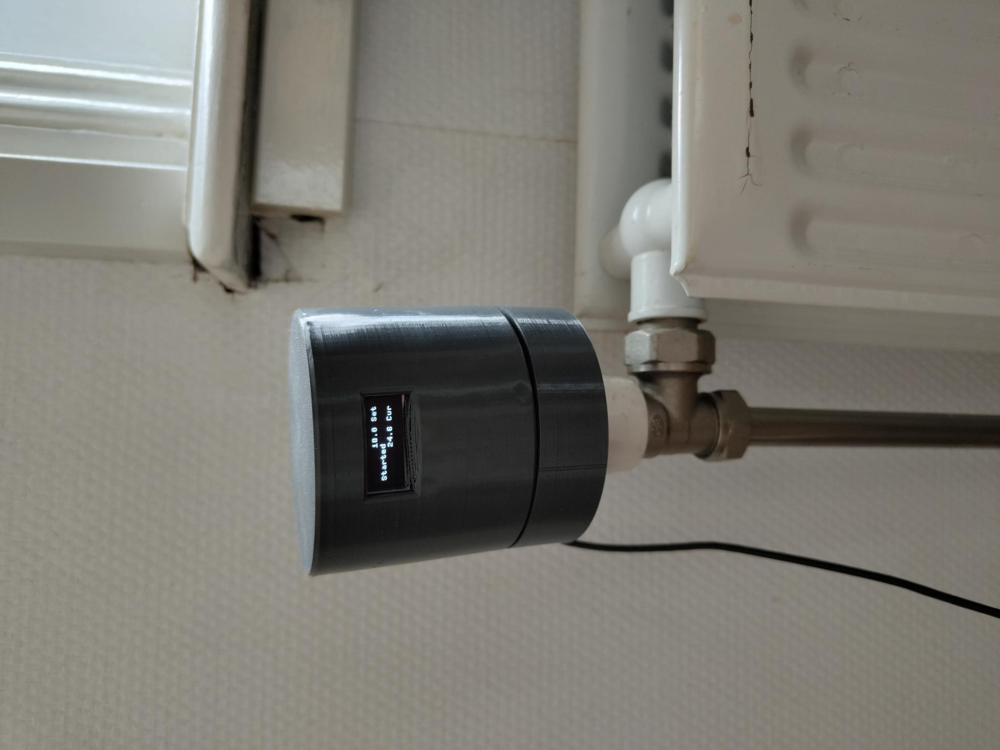
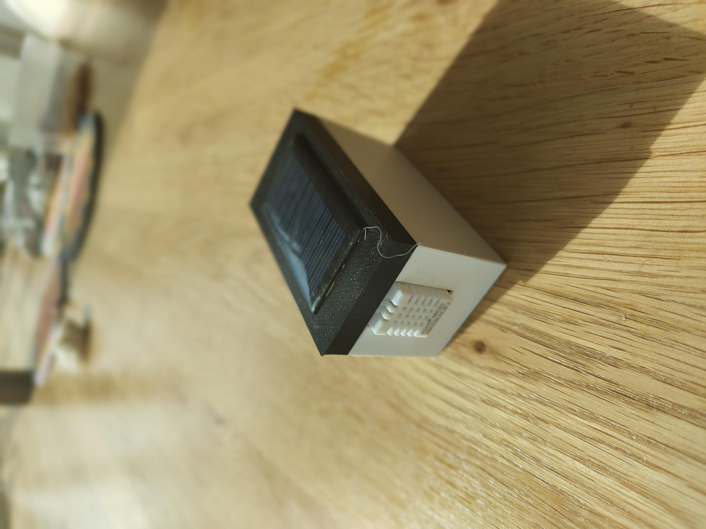
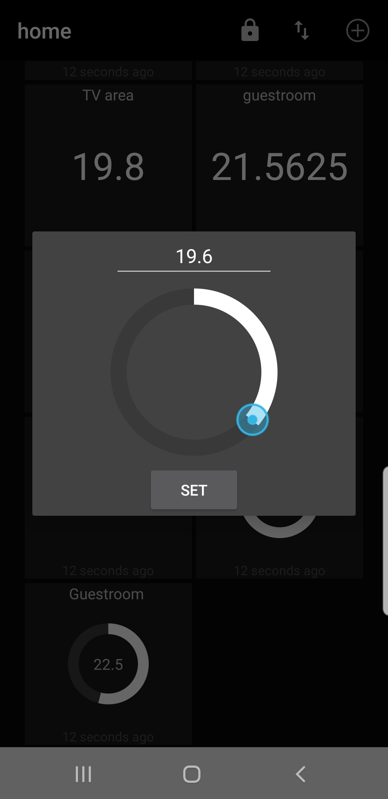
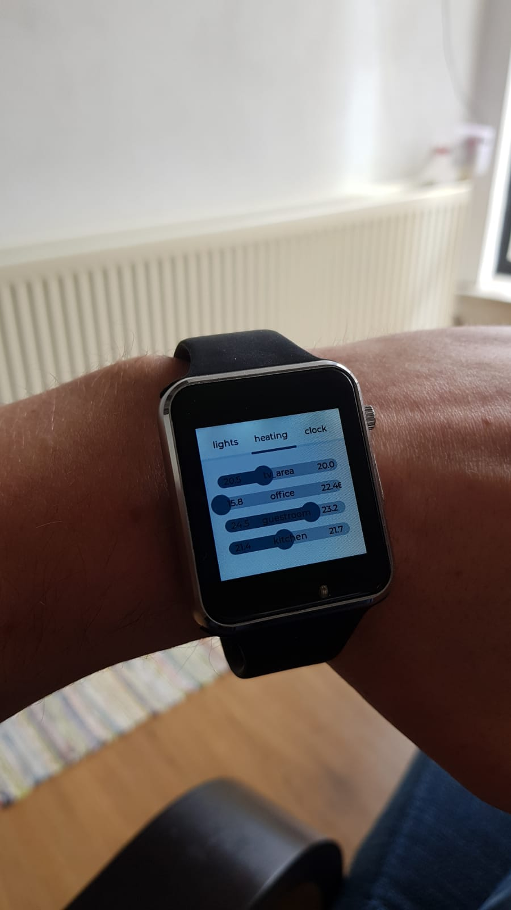
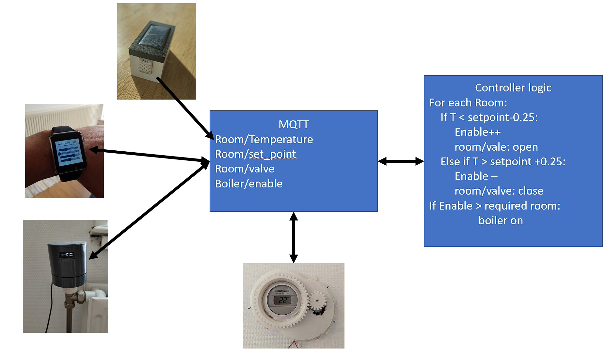

# Heating control system

The 2nd law of thermodynamics states "that the total entropy of a system either increases or remains constant in any spontaneous process; it never decreases." Put in the context of heating a home the most you can hope for is the retain the heat through insulation (keeping the entropy between your house and the outside low), you will always loose the heat to the outside eventually.

This project was started during our first winter in the Netherlands. The radiators in our apartment were furnished with simple open/shut valves with little to no tuning possible, no thermostatic control. The increase in gas price during the pandemic caused my partner and I to experience a few shocks about the heating cost, this led me to think about how to tune the system to save us money.

The first step was solving an issue with the thermostat, this was a single Honeywell round thermostat with no clock for day/night timing and it was also mounted on probably the most poorly insulated wall of the house, so it would show a hybrid temperature of the outside and inside temperature. The thermostat uses OpenTherm to communicate with the boiler and also receive power (it's a 2 wire for power and data protocol). After considering the consequences of damaging the boiler electronics I decided to avoid interfacing with it directly, so the solution was to mechanically control the thermostat.

This involved printing a step down gear system from a 28byj stepper motor to the thermostat. The motor was controlled by an ESP32 connected to an MQTT server. This allowed an MQTT message to set the thermostat value through mechanical manipulation of the thermostat rather than electronic. Also of note is that the boiler is turned either on or off by the thermostat there is nothing in between for fine tuning of temperature.

The next step in the process was to control the follow into the radiators. There were two versions of this created. A first version used some mini-servo motors to rotate the valve and were attached directly to the radiator.

There were 2 of this version made but it suffered from a few design issues, firstly the servo motors were very loud, secondly connecting directly to the radiator allowed the PLA to warm up to a temperature where it become gummy and suffered from creep. Finally the use of ESP-01s made it hard to debug issues occurring on the device, and there was limited IOs to connected something to monitor or log.

The redesign of for version 2 learnt from these lessons and used the same 28byj stepper motor as used to control the thermostat. This motor has very little torque so it was coupled to a planetary gear box. To help debug issues an small oled binary display was added which printed information about the current state.

So with these capable of actuating the system the next issues were sensing and controls.

Sensing was very straightforward, this was done with an ESP32 connected to an DHT22. The ESP32 was in deep sleep for a minute before reading the sensor and again logging the temperature via MQTT. There were a few different electronic designs for this, first using ESP-01s with [the deep sleep hack](https://www.instructables.com/Enable-DeepSleep-on-an-ESP8266-01/), but the possibility of reading with the ULP (the DHT22 has a 2 second warm up) then using the ESP32s main processor only for Wi-Fi based logging convinced me to switch boards. Sadly I never got the ULP aspect fully working. However the devices had ~2 months of battery and served their purpose well.

The control system was very straightforward, if the temperature in a room was bellow a set point it register that the boiler was needed and also open the valve to the radiator. If the temperature was above a second set point it would close the valve and also register that the boiler wasn't needed. The server.py script allowed the number of rooms bellow their set points to be set before which the boiler would enable.

The set points were user determined either by an app or via an customized Lillygo 2020 watch. 

This all comes together in the following system:

[historic Dutch data](https://daggegevens.knmi.nl/klimatologie/uurgegevens)